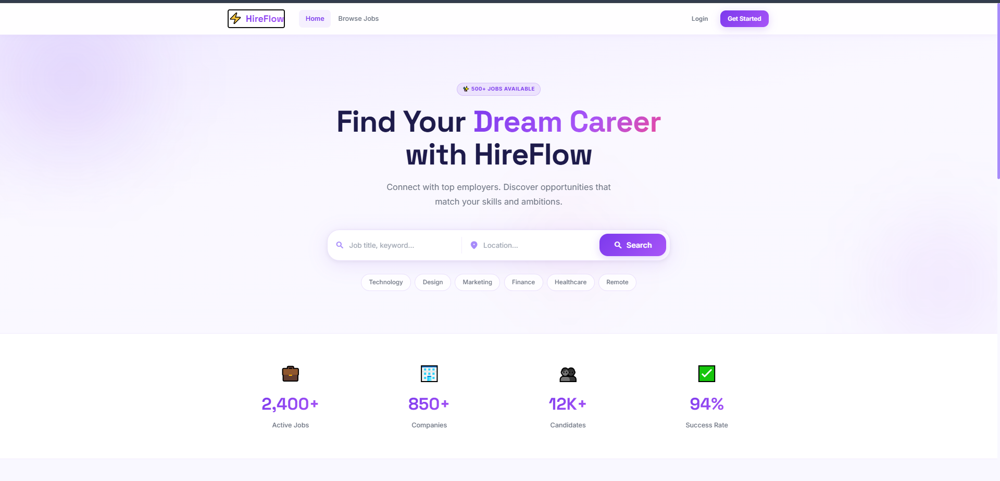
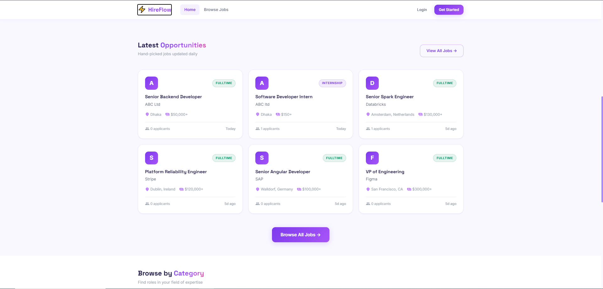
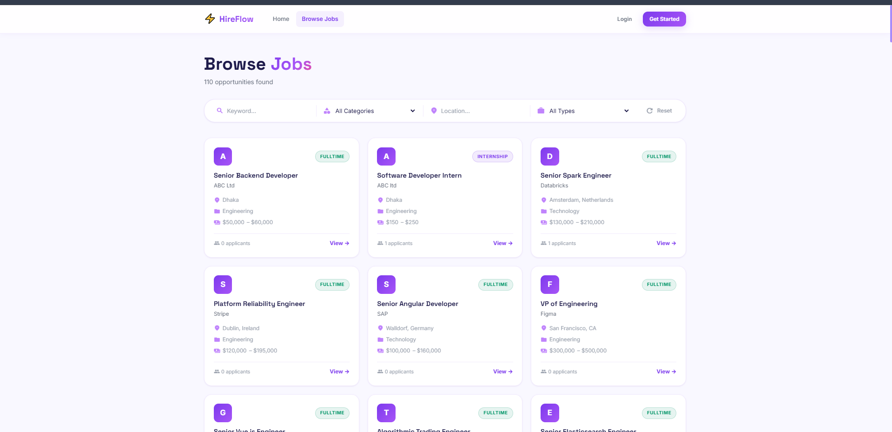
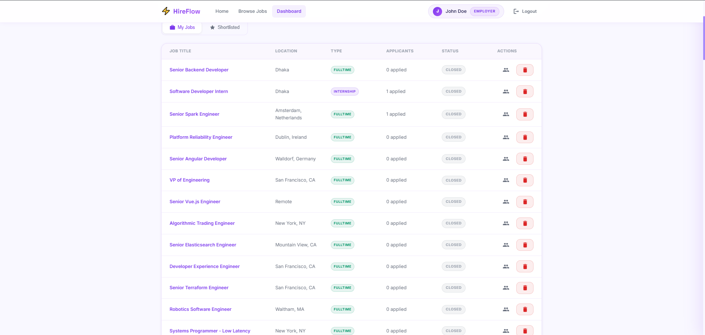
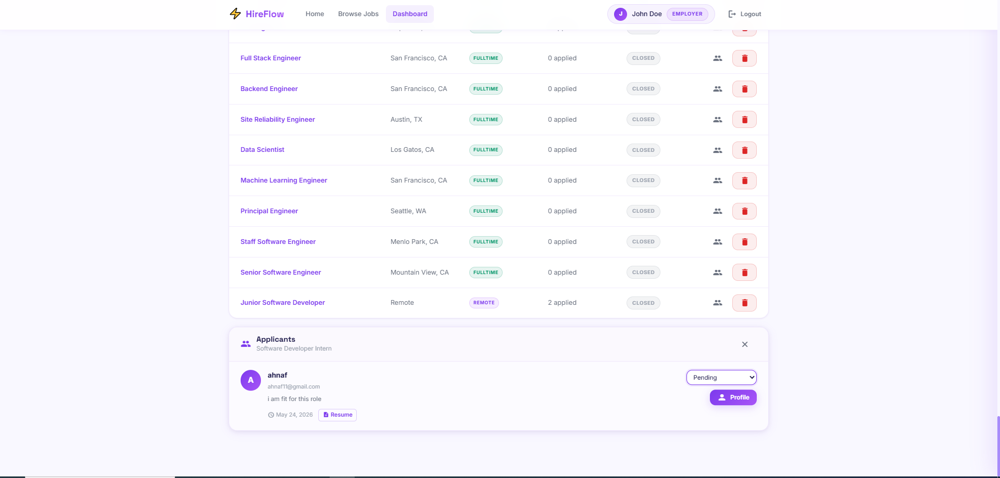

# HireFlow — Job Portal

A full-stack job portal built with **ASP.NET Core 8** (Web API) and **Angular 17** (standalone components). Employers can post jobs, manage applicants, shortlist candidates, and send interview invitations. Candidates can search and filter jobs, apply with a cover letter and CV upload, and track their application status in real time.

---

## Tech Stack

| Layer | Technology |
|---|---|
| Backend API | ASP.NET Core 8 Web API |
| ORM | Entity Framework Core 8 (Code-First, SQL Server) |
| Auth | JWT Bearer tokens |
| Architecture | N-Tier — Domain / Application / Infrastructure / API |
| Frontend | Angular 17 (standalone components, lazy loading) |
| Styling | Inline SCSS, CSS variables, CSS animations |
| File Upload | `multipart/form-data` (`IFormFile` + Angular `FormData`) |
| Email | `System.Net.Mail.SmtpClient` (optional, graceful fallback) |

---

## Features

### Candidate
- Register and login with JWT authentication
- Browse and search jobs by keyword, category, location, and type
- View full job detail page
- Apply with a **cover letter** and **CV/Resume upload** (PDF / DOC / DOCX, max 5 MB)
- Track application status: Pending → Reviewed → Shortlisted → Accepted / Rejected

### Employer
- Post, view, and delete job listings
- View all applicants per job in an expandable inline panel
- Open a **slide-in profile drawer** for any applicant — see full cover letter, download resume, update status
- **Shortlisted tab** — aggregates every shortlisted candidate across all job postings
- **Send interview invitation emails** with date, time, location / video link, and custom message

---

## Project Structure

```
Job-Portal-main/
├── HireFlow.API/            # ASP.NET Core Web API (controllers, Program.cs)
├── HireFlow.Application/    # DTOs, service interfaces, business logic
├── HireFlow.Domain/         # Entities, repository interfaces
├── HireFlow.Infrastructure/ # EF Core DbContext, repositories, EmailService
├── screenshots/             # App screenshots used in this README
└── hireflow-ui/             # Angular 17 frontend
    └── src/app/
        ├── core/            # Services, interceptors, models
        ├── pages/           # Home, Jobs, JobDetail, Dashboard, Auth
        └── shared/          # Navbar component
```

Each layer only depends on the layer below it. Controllers never touch the database — they call services, which call repositories.

---

## Getting Started

### Prerequisites
- [.NET 8 SDK](https://dotnet.microsoft.com/download)
- [Node.js 18+](https://nodejs.org/) and npm
- SQL Server (LocalDB or SQLEXPRESS)

### 1 — Configure the database

Edit `HireFlow.API/appsettings.json`:

```json
"ConnectionStrings": {
  "DefaultConnection": "Server=YOUR_SERVER;Database=HireFlowDb;Trusted_Connection=True;TrustServerCertificate=True;"
}
```

> The database and schema are created automatically on first run via EF Core auto-migration. No manual setup needed.

### 2 — (Optional) Configure email for interview invitations

Fill in the `Email` section in `HireFlow.API/appsettings.json`:

```json
"Email": {
  "SmtpHost": "smtp.gmail.com",
  "Port": "587",
  "Username": "you@gmail.com",
  "Password": "your-app-password",
  "EnableSsl": "true",
  "FromAddress": "noreply@hireflow.com",
  "FromName": "HireFlow"
}
```

Leave `SmtpHost` empty to disable sending (the API returns success and logs a warning — safe for local dev).

### 3 — Run the backend

```bash
cd HireFlow.API
dotnet run
# API: https://localhost:5113
# Swagger: https://localhost:5113/swagger
```

### 4 — Run the frontend

```bash
cd hireflow-ui
npm install
ng serve
# App: http://localhost:4200
```

---

## Seed Data

Use the included PowerShell script to populate ~107 tech job postings under the default employer account:

| Field | Value |
|---|---|
| Email | john@gmail.com |
| Password | 123qaz |
| Role | Employer |

```powershell
# Make sure dotnet run is running first
.\seed-jobs.ps1
```

---

## API Reference

| Method | Route | Auth | Description |
|---|---|---|---|
| POST | `/api/auth/register` | Public | Register as Candidate or Employer |
| POST | `/api/auth/login` | Public | Login, receive JWT |
| GET | `/api/jobs` | Public | List / search / filter jobs |
| GET | `/api/jobs/{id}` | Public | Job detail + hasApplied flag |
| GET | `/api/jobs/my-jobs` | Employer | Employer's own postings |
| POST | `/api/jobs` | Employer | Create job posting |
| DELETE | `/api/jobs/{id}` | Employer | Delete job posting |
| POST | `/api/applications` | Candidate | Apply (multipart/form-data with resume) |
| GET | `/api/applications/my-applications` | Candidate | Candidate's own applications |
| GET | `/api/applications/job/{jobId}` | Employer | Applicants for a specific job |
| PATCH | `/api/applications/{id}/status` | Employer | Update applicant status |
| GET | `/api/applications/shortlisted` | Employer | All shortlisted candidates (all jobs) |
| POST | `/api/applications/{id}/interview-invite` | Employer | Send interview invitation email |

---

## Frontend Routes

| Route | Description |
|---|---|
| `/` | Home — hero search, featured jobs, category browser |
| `/jobs` | Browse all jobs with live filters |
| `/jobs/:id` | Job detail with apply form (CV upload) |
| `/dashboard` | Role-based dashboard (employer or candidate) |
| `/auth/login` | Login |
| `/auth/register` | Register with role selection |

---

## Adding EF Migrations

If you change an entity, create and apply a migration:

```bash
dotnet ef migrations add YourMigrationName --project HireFlow.Infrastructure --startup-project HireFlow.API
dotnet ef database update --project HireFlow.Infrastructure --startup-project HireFlow.API
```

---

## Screenshots

### Home — Hero


### Home — Latest Opportunities


### Browse Jobs


### Employer Dashboard — My Jobs


### Employer Dashboard — Applicants Panel

